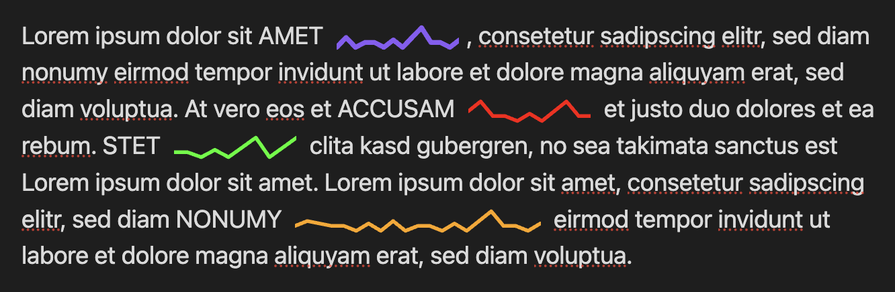

## Sparklines Plugin for Obsidian

[](https://github.com/deeplook/obsidian-sparklines/actions/workflows/ci.yml)
[](https://github.com/deeplook/obsidian-sparklines/releases)
[](https://github.com/deeplook/obsidian-sparklines/blob/main/manifest.json)
[](LICENSE)
[](https://github.com/deeplook/obsidian-sparklines/releases)
[](https://obsidian.md/plugins?id=sparklines)
[](https://www.typescriptlang.org/)
[](https://www.buymeacoffee.com/deeplook)



This is an [Obsidian](https://obsidian.md) plugin to render inline [sparklines](https://en.wikipedia.org/wiki/Sparkline) as SVG in Markdown notes in paragraphs, tables and other contexts. The numeric values can be literal numbers inside code blocks or be pulled from frontmatter properties or Obsidian bases. Many examples are available in the example vault in this repository (after installing the plugin there, manually).

### Installation

This plugin has been [submitted](https://github.com/obsidianmd/obsidian-releases/pull/9694) as a community plugin, the review is pending. Until accepted you need to install it manually as described below.

1. Install dependencies and build the plugin:

```bash
npm install
npm run build
```

2. Copy the following files to your Obsidian vault's plugins folder:
   - `main.js`
   - `manifest.json`
   - `styles.css`

```bash
# Example: copy to your vault
cp main.js manifest.json styles.css /path/to/your/vault/.obsidian/plugins/sparkline/
```

3. Enable the plugin in Obsidian: Settings > Community plugins > Sparkline Inline

### Syntax

Use inline code blocks with the following syntax:

```
`sparkline: [<data>] <options>`
```

**Data** can be either:
- **Literal numbers**: `[1 2 3 4 5]` or `[1, 2, 3, 4, 5]`
- **Frontmatter reference**: `[@key]` or `[@frontmatter:key]`

**Options** (all optional, placed after the brackets):

| Option | Description | Default |
|--------|-------------|---------|
| `color="<value>"` | Stroke color (CSS format) | Obsidian accent color |
| `width=<n>` | SVG width in pixels | 100 |
| `line-width=<n>` | Line thickness | 1.0 |
| `view-height=<n>` | ViewBox height | 20 |
| `padding=<n>` | Vertical padding | 2.0 |
| `cap=<value>` | Line cap style: `butt`, `round`, `square` | round |
| `join=<value>` | Line join style: `miter`, `round`, `bevel` | round |
| `dash="<pattern>"` | Dash pattern (e.g., `"5,3"`) | solid line |

The stroke options also accept SVG attribute names: `linecap`, `line-cap`, `stroke-linecap`, `linejoin`, `line-join`, `stroke-linejoin`, `dasharray`, `dash-array`, `stroke-dasharray`.

The default color uses Obsidian's accent color (`--interactive-accent`), which matches your theme settings.

### Examples in Obsidian

**Literal data:**
```markdown
A simple trend: `sparkline: [1 2 3 4 5]`

Stock prices: `sparkline: [100 95 102 98 110] color="green" width=150`

Temperature data: `sparkline: [72, 75, 71, 68, 70] color="blue" line-width=2`

Activity graph: `sparkline: [3 1 4 1 5 9 2 6] color="#ff6600" width=200`

Dashed line: `sparkline: [1 2 3 4 5] dash="5,3"`

Square caps: `sparkline: [1 2 3 4 5] cap=square join=bevel`
```

**Dynamic data from frontmatter:**
```markdown
---
stats: 10, 25, 15, 30, 20
temperatures: 72, 75, 71, 68, 70
---

My stats: `sparkline: [@stats] color="blue"`

Temperatures: `sparkline: [@temperatures] color="orange"`
```

Use comma-separated numbers as text - this displays correctly in Obsidian's Properties editor without warnings.

### Data Sources

| Source                 | Syntax                  | Status    |
| ---------------------- | ----------------------- | --------- |
| Literal                | `[1 2 3]`               | Supported |
| Frontmatter (short)    | `[@key]`                | Supported |
| Frontmatter (explicit) | `[@frontmatter:key]`    | Supported |
| Bases                  | `[@bases:Table:column]` | Supported |
| Dataview               | `[@dataview:query]`     | Planned   |

These render as inline SVG graphics that scale with your text. The example vault in the repository contains many examples for sparklines inside notes with different contexts, that show numeric values from literals, frontmatter properties or bases files.
